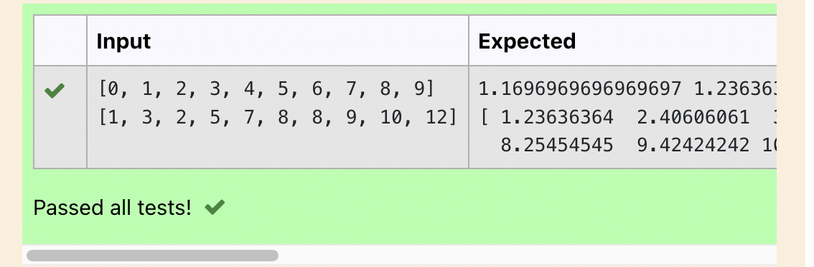

# Implementation of K-Means Clustering Algorithm
## Aim
To write a python program to implement K-Means Clustering Algorithm.
## Equipment’s required:
1.	Hardware – PCs
2.	Anaconda – Python 3.7 Installation

## Algorithm:

### Step1:
 
Import pandas.

### Step2
 
Import matplotlib.pyplot.

### Step3
 

Import sklearn.cluster from KMeans module

### Step4
 
Import seaborn

### Step5
 
Import warnings

###step6
 
Declare warnings.filerwarning with ignore as argument

###step7
 
Declare a variable x1 and read a csv file(clustering.csv) in it.

###step8
 
Declare a variable x2 as index of x1 with arguments ApplicantIncome and LoanAmount.

###step9
 
Display x1.head(2) and x2.head(2).

###step10
 
Declare a variable x and store x2.values.

###step11
 
Declare sns.scatterplot for ApplicantIncome and LoanAmount by indexing

###step12
 
Plot Income , Loan and display them.

###step13
 
Declare a variable kmean = KMean(n_cluster_centers_) and execute kmean.fit(x).

###step14
 
Display kmean.cluster)centers

###step15
 
Display kmean.labels_

###step16
 
Declare a variable predcited_class to kmean.predict([[]]) and give two arguments in it.

###step17
 
Display the predicted_class

## Program:
~~~
#Developed by: Kandukuri sai eswar
#Register number: 212221240020
import pandas as pd
import matplotlib.pyplot as plt
from sklearn.cluster import KMeans
import seaborn as sns
import warnings
warnings.filterwarnings('ignore')
x1 = pd.read_csv('clustering.csv')
print(x1.head(2))
x2 = x1.loc[:,['ApplicantIncome','LoanAmount']]
print(x2.head(2))

x=x2.values
sns.scatterplot(x[:,0],x[:,1])
plt.xlabel('Income')
plt.ylabel('Loan')
plt.show()

kmean = KMeans(n_clusters=4)
kmean.fit(x)

print('Cluster Centers:',kmean.cluster_centers_)
print('Labels:',kmean.labels_)

predicted_class = kmean.predict([[9200,110]])
print('The cluster group for Applicant Income 9000 and Loanamount',predicted_class)

~~~
## Output:

### Insert your output

 

## Result
Thus the K-means clustering algorithm is implemented and predicted the cluster class using python program.
